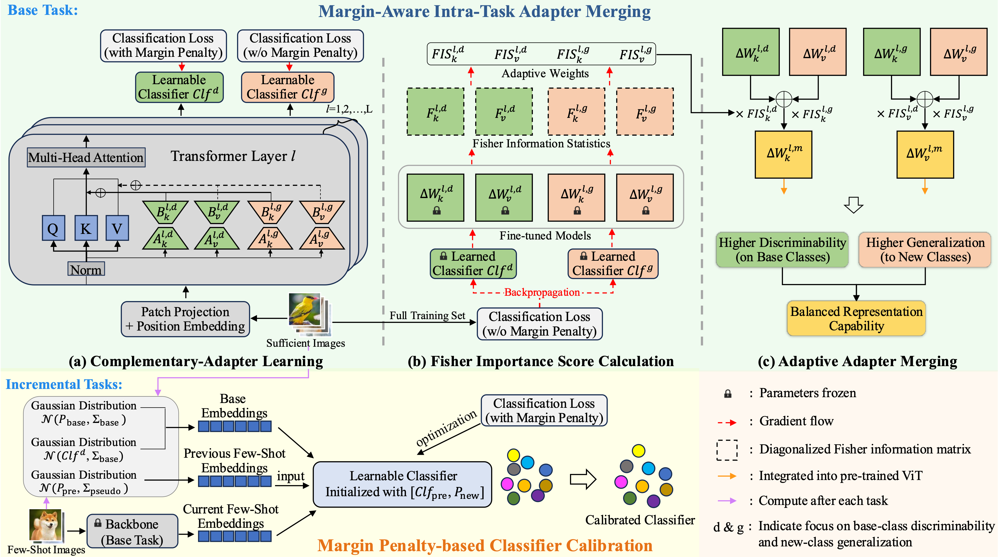

# Sculpting Margin Penalty: Intra-Task Adapter Merging and Classifier Calibration for Few-Shot Class-Incremental Learning

## Introduction
>Real-world applications often face data privacy constraints and high acquisition costs, making the assumption of sufficient training data in incremental tasks unrealistic and leading to significant performance degradation in class-incremental learning. Forward-compatible learning, which prospectively prepares for future tasks during base task training, has emerged as a promising solution for Few-Shot Class-Incremental Learning (FSCIL). However, existing methods still struggle to balance base-class discriminability and new-class generalization. Moreover, limited access to original data during incremental tasks often results in ambiguous inter-class decision boundaries. To address these challenges, we propose SMP (Sculpting Margin Penalty), a novel FSCIL method that strategically integrates margin penalties at different stages within the parameter-efficient fine-tuning paradigm. Specifically, we introduce the Margin-aware Intra-task Adapter Merging (MIAM) mechanism for base task learning. MIAM trains two sets of low-rank adapters with distinct classification losses: one with a margin penalty to enhance base-class discriminability, and the other without margin constraints to promote generalization to future new classes. These adapters are then adaptively merged to improve forward compatibility. Furthermore, we propose a Margin Penalty-based Classifier Calibration (MPCC) strategy to alleviate decision boundary ambiguity during incremental tasks. Extensive experiments on CIFAR100, ImageNet-R, and CUB200 demonstrate that SMP achieves state-of-the-art performance in FSCIL while maintaining a better balance between base and new classes.

## Environments
- Python 3.10.6
- PyTorch 2.1.0
- CUDA 12.1.0
- torchvision 0.16.0
- timm 0.6.7

## Dataset
Please refer to [ASP](https://github.com/dawnliu35/fscil-asp) to prepare the datasets: CIFAR-100, ImageNet-R, CUB-200.
## Usage


### Training script for CIFAR-100
```python
python main.py --config=./exps_px/px_d1_cifar.json --common_param 0.2 --common_param2 16 --tag log_tag --backbone_type vit_base_patch16_224
```
### Training script  for ImageNet-R
```python
python main.py --config=./exps_px/px_d1_inr.json --common_param 0.2 --common_param2 16 --tag log_tag --backbone_type vit_base_patch16_224
```
### Training script  for CUB200
```python
python main.py --config=./exps_px/px_d1_cub.json --common_param 0.2 --common_param2 16 --tag log_tag --backbone_type vit_base_patch16_224
```
